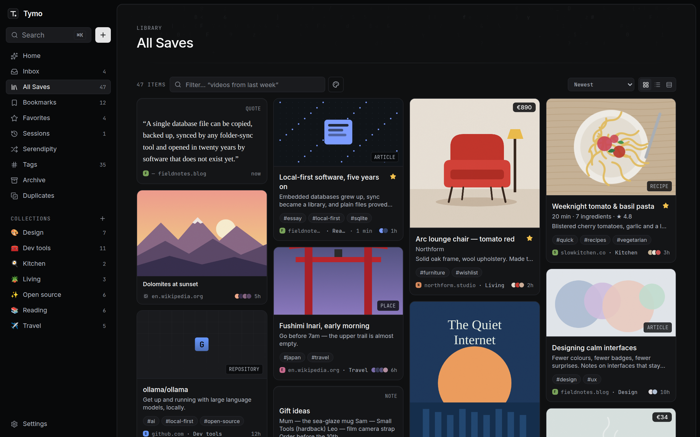
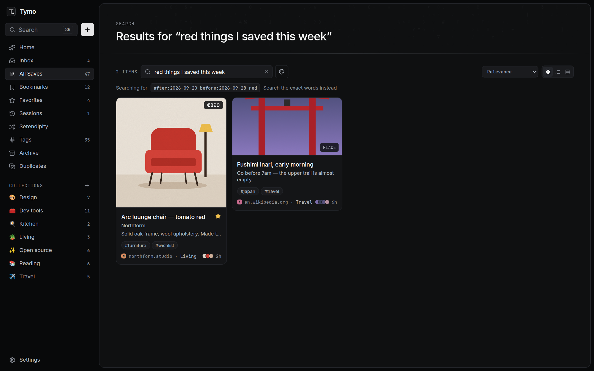
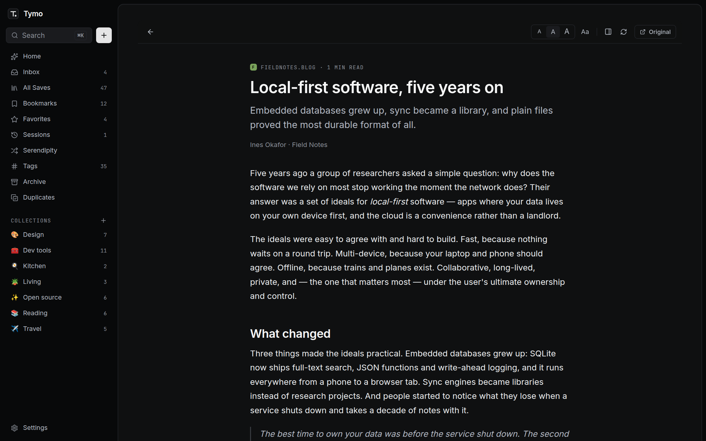
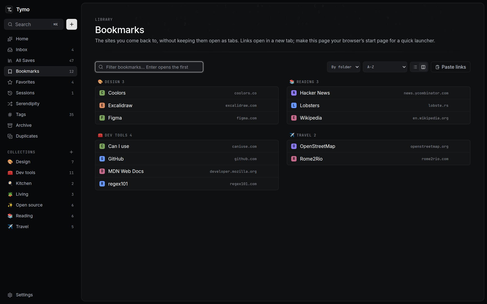
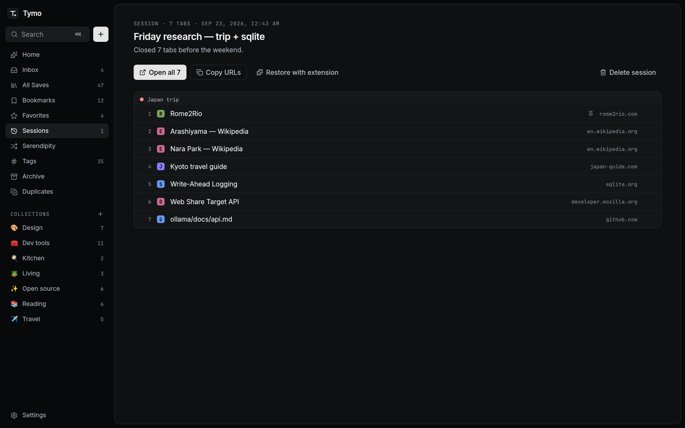
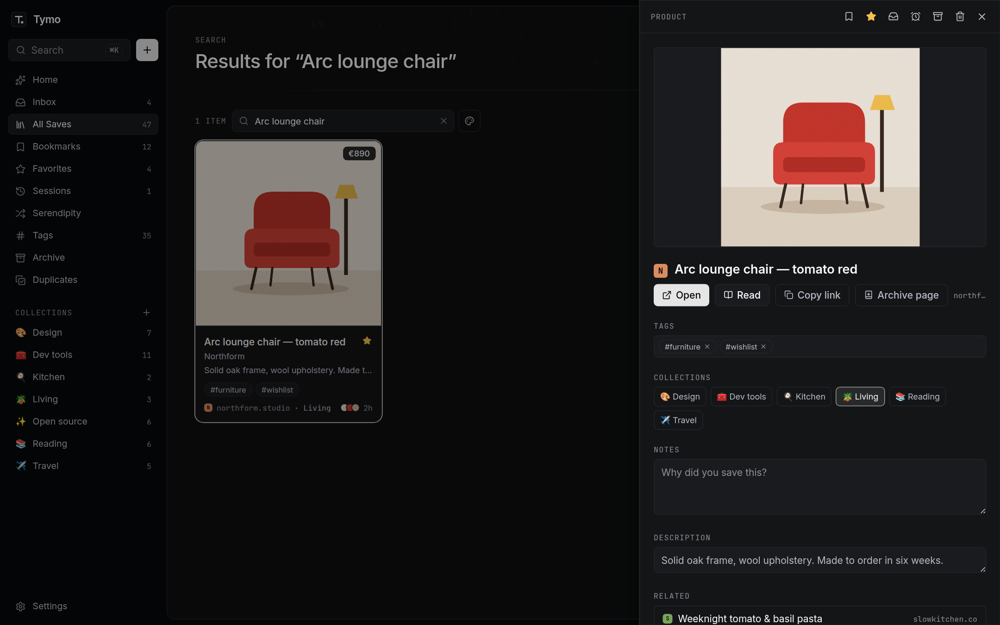
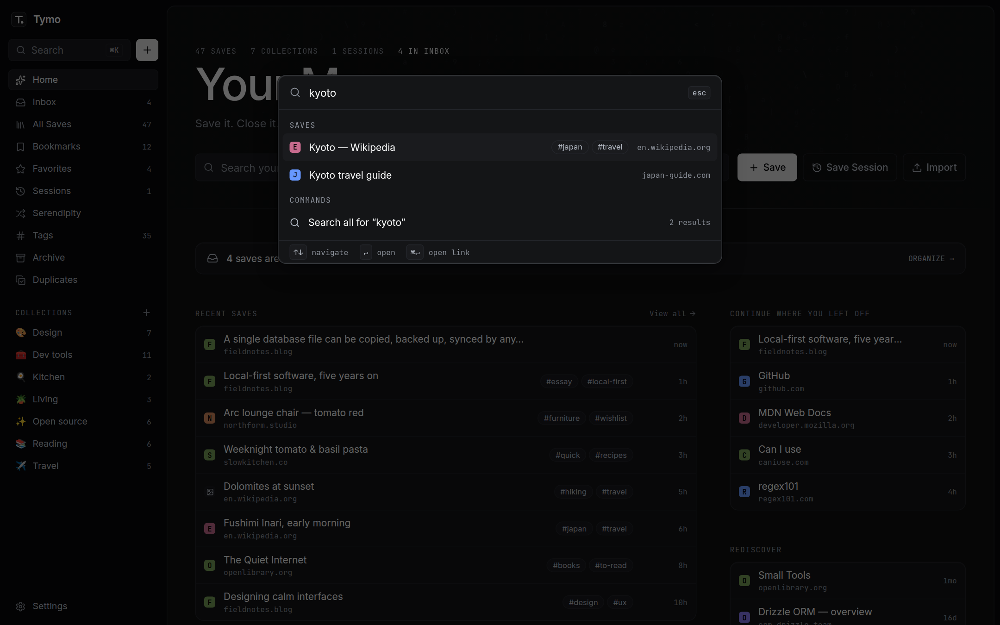
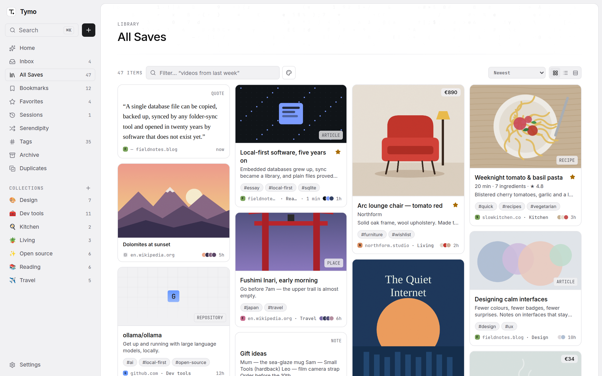
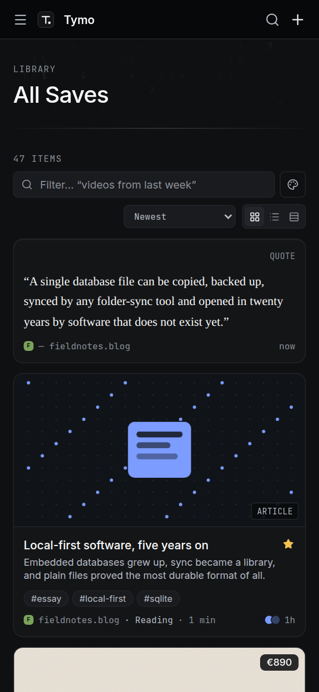

<div align="center">


# Tymo

### Save it. Close it. Find it later.

A calm, private home for everything you find on the internet: pages, tabs, bookmarks,
images, quotes and notes. Local-first, open source, no account.

[Install](#install) · [Features](#features) · [Extension](#browser-extension) · [Keep your data safe](#keep-your-data-safe) · [AI & Claude](#use-tymo-from-ai-assistants-mcp) · [Self-host](#self-hosting)

<br />



</div>

You keep tabs open because closing them feels like forgetting. Tymo makes saving faster
than leaving the tab open: one shortcut saves a page, one click saves your **whole session**
of 47 tabs and closes them, and search brings anything back in seconds, even when all you
remember is _“that red chair from last week”_.

- 🔒 **Yours.** One SQLite file on your own computer. No account, no analytics, no telemetry.
- ⚡ **Fast.** Keyboard-first, instant full-text search, built for libraries of 10,000+ items.
- 🧠 **AI optional.** Everything works without it; turn it on with a local model (Ollama) or your own key.
- 🆓 **Free.** MIT licensed. Runs on a Mac, a Raspberry Pi or any server.

## A quick tour

|                                                                                                                                                                                  |                                                                                                                                                               |
| -------------------------------------------------------------------------------------------------------------------------------------------------------------------------------- | ------------------------------------------------------------------------------------------------------------------------------------------------------------- |
|  **Search the way you remember.** “red things I saved this week” becomes a date range plus a colour search, no AI needed. |  **Read without the noise.** A clean reader for any saved article; highlight a passage to keep it as a quote card. |
|  **Bookmarks, not open tabs.** Your everyday sites on one launcher page, grouped by folder, in a list or two columns.                |  **Close 40 tabs without fear.** Save a whole window, tab groups and all, and restore it later exactly as it was.    |
|  **Everything about a save in one panel.** Tags, collections, notes, related saves, offline copy.                                    |  **⌘K for everything.** Jump to any save or command without touching the mouse.                       |

<p align="center">
  
  &nbsp;
  
</p>

## Install

All options are free and keep your library on your own computer.

### ⬇️ Download the app (easiest)

Go to **[Releases](../../releases/latest)** and download the file for your computer:

| Computer                                          | File                           |
| ------------------------------------------------- | ------------------------------ |
| Mac with Apple chip (M1–M4)                       | `Tymo-…-mac-arm64.dmg`         |
| Mac with Intel chip (Apple menu → About This Mac) | `Tymo-…-mac-x64.dmg`           |
| Windows 10/11                                     | `Tymo-…-win-x64.exe`           |
| Linux                                             | `Tymo-…-linux-x86_64.AppImage` |

- **Mac:** open the `.dmg`, drag **Tymo** into **Applications**, then open it. The app isn't
  signed by Apple yet, so the first time macOS says it can't check it: open **System
  Settings → Privacy & Security**, scroll down and click **Open Anyway**. Only once.
- **Windows:** run the installer. If “Windows protected your PC” appears, click **More info →
  Run anyway**. Tymo is added to the Start menu.

Tymo opens in its own window. Links you saved open in your normal browser, the browser
extension connects to it as usual, and your library is backed up every day (to **iCloud
Drive → Tymo Backups** on a Mac when iCloud Drive is on). Library location:
`~/Library/Application Support/Tymo/data` (Mac) · `%APPDATA%\Tymo\data` (Windows) ·
`~/.config/Tymo/data` (Linux). **File → Show Library Folder** opens it.

**Updates:** when a new version is released, Tymo offers it in a pop-up (checked once a day, or
any time with **Tymo → Check for Updates…**). It downloads the right file for your computer
and opens it; on a Mac, drag Tymo into Applications and choose **Replace**. Your library is kept.

### 🍎 Mac, from the source code (runs in the background at login)

1. Install **Node.js 22 or newer** (the “LTS” installer from [nodejs.org](https://nodejs.org)).
2. Download Tymo (**Code → Download ZIP** on GitHub, then unzip it), open **Terminal** in that folder and run:

   ```bash
   npm run mac:install
   ```

That's it. Tymo now starts by itself every time you log in (in the background, only
reachable from your own Mac) and opens at **http://127.0.0.1:3210**.

**Make it feel like an app:** open that address in **Safari → File → Add to Dock**, or in
**Chrome / Dia / Edge → ⋮ → Install page as app**. Tymo gets its own window, Dock icon and
⌘-Tab entry — no browser tabs or address bar.

Your library lives in `~/Library/Application Support/Tymo`. To update, download the new
version and run `npm run mac:install` again (your data is kept). To remove it:
`npm run mac:uninstall`.

### 🐳 Docker (any computer or server)

```bash
cp .env.example .env         # optional: set TYMO_PASSWORD, AI settings
docker compose up -d         # → http://127.0.0.1:3210
```

See [Self-hosting](#self-hosting) before putting it on a network.

### 🛠️ From source (Windows, Linux, macOS)

Requires **Node.js 22+**.

```bash
git clone <repository-url> tymo   # your fork or the project repository
cd tymo
npm install
npm run build
npm start          # → http://127.0.0.1:3210
```

Your library lives in `apps/web/data/`. In Chrome or Edge, use **Install Tymo** in the
address bar to get an app window on Windows and Linux too.

## Keep your data safe

Your library is one database plus a folder of files, so keeping a copy is easy — and free.

| What                                           | How                                                                                                                                                                                                                                        |
| ---------------------------------------------- | ------------------------------------------------------------------------------------------------------------------------------------------------------------------------------------------------------------------------------------------ |
| **Automatic daily backups, off your computer** | The Mac app writes a full backup every day to **iCloud Drive → Tymo Backups** when iCloud Drive is on (5 GB free). Anywhere else, set `TYMO_BACKUP_DIR` to a Dropbox, Google Drive, OneDrive or external-disk folder. The last 7 are kept. |
| **Time Machine**                               | Covers `~/Library/Application Support/Tymo` automatically if you use it.                                                                                                                                                                   |
| **One-click backup file**                      | **Settings → Backup & restore → Download full backup**: one `.tar.gz` with everything (database, uploads, screenshots, archived pages). Restore it on any Tymo install, on any computer.                                                   |
| **Portable exports**                           | **Settings → Export**: JSON, CSV, browser-bookmarks HTML or Markdown, readable without Tymo.                                                                                                                                               |

Backups never contain your AI key. Tymo doesn't encrypt them, so for a cloud folder you
may want iCloud's Advanced Data Protection or an encrypted disk.

**New computer?** Install Tymo there, then **Settings → Backup & restore → Restore** and
pick the latest backup from your iCloud/Dropbox folder.

## Features

**Capture**

- **Save anything** — pages, links, selected text, images, screenshots, PDFs, notes. Types are detected automatically (repo, article, video, post, place, recipe, product, book, movie, tool…).
- **Sessions** — snapshot every tab in a window (or all windows) including order, pinned tabs and tab groups. Close them with one click, restore them later exactly as they were.
- **Bookmarks** — a launcher page for the sites you come back to. Paste Safari's _Copy Links_ or any list of URLs, import browser bookmarks, or save all tabs as bookmarks from the extension.
- **Highlights** — select text in the reader (or anywhere with the extension) to save it as a quote card that links back to the exact passage.
- **From your phone** — installed on Android, Tymo appears in the Share sheet; on iOS use _Share → Add to Home Screen_.
- **No lock-in** — import browser bookmarks, **Pocket**, **Raindrop.io**, **Instapaper**, **Pinboard**, Tymo exports or any CSV with URLs.

**Organize**

- **Inbox** — new saves land here. File them into a collection, mark done with <kbd>E</kbd>, or **snooze** them until tomorrow, the weekend or next week.
- **Collections** — manual, nested, or **smart** (rules like _domain contains github.com OR tag is open-source_) with a live preview.
- **Tags** — lightweight, no taxonomy to maintain. Rename to merge.
- **Serendipity** — resurface older saves one at a time and decide in a keystroke: keep, archive, favorite or snooze.
- **Related & duplicates** — every save shows related saves; the Duplicates page merges links that redirect to the same page without losing tags, notes or history.

**Find**

- **Search** — SQLite FTS5 over titles, URLs, tags, notes and the page text, with operators: `tag:osint` `#dfir` `domain:github.com` `type:repo` `is:fav` `is:bookmark` `is:snoozed` `is:broken` `in:inbox` `color:red` `collection:"AI Tools"` `after:2026-01-01` `-exclude` `"exact phrase"`.
- **Natural language** — “articles about rust from last week”, “videos on youtube I haven't watched”, “my favorite recipes” are understood without AI.
- **Search by colour** — every image's main colours are measured locally; click a colour dot or type `color:red`.
- **Keyboard-first** — <kbd>⌘K</kbd> palette, <kbd>N</kbd> new save, paste a URL anywhere to save it, <kbd>J</kbd>/<kbd>K</kbd> move, <kbd>F</kbd> favorite, <kbd>B</kbd> bookmark, <kbd>R</kbd> read, <kbd>G</kbd> then a letter to jump, <kbd>?</kbd> for the full list.

**Read and keep**

- **Visual board** — a masonry board where the content decides the card: prices on products, time and ingredients on recipes, covers for books and films, quotes set in serif.
- **Reader view** — a clean, formatted version of any article, without ads, menus or pop-ups. Text size and a serif option are remembered.
- **Page archiving** — a private offline copy of any page (never scripts), so it survives link rot. **Link-rot detection** flags dead links and points to your copy.
- **Private images** — favicons and previews load through Tymo's own proxy, so the sites you save never see your browser.
- **Light and dark themes**, grid, list and dense views.

**Optional AI** — suggestions for titles, tags and collections (you review, nothing changes
silently), semantic search, image understanding, and a connector so **Claude** can search
and add to your library. Runs fully local with Ollama. [More below](#ai-optional).

## Browser extension

Chromium (Chrome, Edge, Brave, Arc, Vivaldi) and Firefox, Manifest V3.

```bash
npm run build -w @tymo/extension     # → apps/extension/dist/chrome and dist/firefox
```

- **Chromium:** `chrome://extensions` → enable _Developer mode_ → _Load unpacked_ → `apps/extension/dist/chrome`
- **Firefox:** `about:debugging#/runtime/this-firefox` → _Load Temporary Add-on_ → `apps/extension/dist/firefox/manifest.json`

Then in Tymo open **Settings → Browser extension**, create a token, and paste the server
URL and token into the extension's settings page.

| Action                                          | How                                                                                          |
| ----------------------------------------------- | -------------------------------------------------------------------------------------------- |
| Quick save (edit title, collection, tags, note) | <kbd>Alt</kbd>+<kbd>Shift</kbd>+<kbd>S</kbd> or the toolbar button                           |
| Save current tab instantly                      | <kbd>Alt</kbd>+<kbd>Shift</kbd>+<kbd>D</kbd>                                                 |
| Save this window as a session                   | <kbd>Alt</kbd>+<kbd>Shift</kbd>+<kbd>E</kbd>, or popup → _Session_ → then _Close saved tabs_ |
| Restore a session                               | popup → _Restore_                                                                            |
| Search your library                             | popup → _Find_ (same operators as the app)                                                   |
| Save all tabs as bookmarks                      | popup → _Save tabs as bookmarks_ (tab groups become folders)                                 |
| No extension (Safari, other browsers)           | Settings → copy the _Save to Tymo_ bookmarklet                                               |
| Keep an offline copy when saving                | popup → _Keep an offline copy of this page_ (remembered)                                     |
| Save link / selection / image / screenshot      | right-click menu                                                                             |

**Permissions:** `activeTab`, `tabs` (to read tab URLs for sessions), `storage`,
`contextMenus`, `tabGroups` (Chromium). No content scripts and no access to the pages you
visit; the extension asks for host permission for **your Tymo server only**. Safari is
architected for (standard WebExtension APIs only) but not yet packaged.

## Use Tymo from AI assistants (MCP)

### claude.ai (web and mobile) — remote connector

Tymo has a built-in remote MCP server at `/mcp` with OAuth, so you can add it to claude.ai as
a custom connector and use your library from Claude on any device.

Requirements: Tymo reachable over **HTTPS** with **`TYMO_PASSWORD` set** (see
[Before exposing Tymo](#before-exposing-tymo-to-a-network-or-the-internet)), and
`TYMO_PUBLIC_URL` set to its address (e.g. `https://tymo.example.com`).

1. In claude.ai: **Settings → Connectors → Add custom connector**.
2. Name: `Tymo` · URL: `https://tymo.example.com/mcp` (copy it from Tymo → Settings → AI
   assistants). Leave the advanced OAuth fields empty: Claude registers itself.
3. Click **Connect**. Tymo opens: sign in, check the app's return address (`claude.ai`),
   choose whether Claude may also add and organize saves, and click **Allow**.

Manage or disconnect it any time in Tymo → Settings → AI assistants. Under the hood:
OAuth 2.1 with dynamic client registration, PKCE (S256), tokens bound to the `/mcp`
resource, 1-hour access tokens and rotating refresh tokens, all stored hashed.

The same endpoint accepts a regular Tymo API token as a bearer header, for clients you
configure by hand:
`claude mcp add --transport http tymo https://tymo.example.com/mcp --header "Authorization: Bearer tymo_…"`.

### Claude Desktop and Claude Code — local server

Tymo ships an [MCP](https://modelcontextprotocol.io) server, so Claude (Claude Desktop and
Claude Code) and other MCP clients can search your library, read saved pages, save links,
notes and highlights, and organize items, all through your own server and an API token
you can revoke.

1. Build it once: `npm run build -w @tymo/mcp` → `apps/mcp/dist/tymo-mcp.mjs` (one file).
2. Create a token: Tymo → Settings → Browser extension → _Create token_.
3. Connect your client:

**Claude Code**

```bash
claude mcp add tymo -e TYMO_URL=http://127.0.0.1:3210 -e TYMO_TOKEN=tymo_… \
  -- node /path/to/tymo/apps/mcp/dist/tymo-mcp.mjs
```

**Claude Desktop** (Settings → Developer → Edit config, `claude_desktop_config.json`):

```json
{
  "mcpServers": {
    "tymo": {
      "command": "node",
      "args": ["/path/to/tymo/apps/mcp/dist/tymo-mcp.mjs"],
      "env": { "TYMO_URL": "http://127.0.0.1:3210", "TYMO_TOKEN": "tymo_…" }
    }
  }
}
```

Restart Claude Desktop, then ask things like _"what did I save about Rust last month?"_ or
_"save this quote to Tymo"_. Tymo must be running.

Tools: `search_library`, `get_save`, `related_saves`, `save_link`, `save_note`,
`save_highlight`, `update_save`, `list_collections`, `list_tags`. There is no delete tool
(archiving is the most destructive action, and it is reversible). Saved page text is
passed to the assistant fenced as untrusted content, so instructions hidden in a web page
are treated as data. If Tymo runs on another machine, use `https://` in `TYMO_URL`: the
server warns when the token would travel over plain HTTP. The REST API itself is
documented in [docs/API.md](docs/API.md).

## Self-hosting

With Docker (see [Install](#install)), the container runs as a non-root user on a read-only filesystem with all capabilities
dropped, stores everything in the `tymo-data` volume, and the default compose file
publishes it on `127.0.0.1` only.

### Before exposing Tymo to a network or the internet

1. **Set a strong `TYMO_PASSWORD`** (12+ characters; a few random words is ideal). Exposed
   containers refuse to start without one, or with one shorter than 8 characters.
2. Set `TYMO_ALLOW_NO_AUTH=0` and change the port mapping in `docker-compose.yml`.
3. **Put HTTPS in front** (Caddy, Traefik, nginx). Behind it, set `TYMO_TRUST_PROXY=1` so
   login rate limits are per client, and `TYMO_SECURE_COOKIES=1` if the proxy doesn't send
   `X-Forwarded-Proto`.
4. Turn on daily backups (Settings → Backup, or `TYMO_AUTO_BACKUP=1`) and copy
   `DATA_DIR/backups` somewhere else now and then. Backups never contain your AI key.
5. Keep the image up to date (`docker compose build --pull && docker compose up -d`).

Example Caddy config (automatic HTTPS):

```
tymo.example.com {
  reverse_proxy 127.0.0.1:3210
}
```

Without a password, Tymo only answers to `localhost`, `127.0.0.1` and IP addresses (a
DNS-rebinding guard). To use another hostname on your network, list it in
`TYMO_ALLOWED_HOSTS`.

Headless setups can create an extension token without the UI:
`TYMO_DATA_DIR=./apps/web/data node apps/web/scripts/create-token.mjs "My laptop"`.

## Architecture

One Next.js process, one SQLite file, one data directory — no microservices.

```
apps/web         Next.js 16 (App Router, Server Actions), Tailwind v4, Drizzle + libSQL, SQLite FTS5
apps/extension   MV3 WebExtension (TypeScript, esbuild) for Chromium + Firefox
apps/mcp         MCP server (stdio) over the REST API, for Claude and other AI assistants
desktop          Electron app (.dmg / .exe / AppImage) that runs the same server in a window
packages/core    Pure TS: validation, URL safety, type detection, HTML metadata, bookmarks, query parser, smart rules
```

Details: [docs/ARCHITECTURE.md](docs/ARCHITECTURE.md) (data model, API, extension protocol,
design tokens) · [docs/PROJECT_SPEC.md](docs/PROJECT_SPEC.md).

## Security

Security is a feature. Highlights: DNS-rebinding-proof SSRF protection for metadata
fetching, strict nonce-based CSP, no raw HTML rendering (lint-enforced), magic-byte
upload validation served in a CSP sandbox, bearer-token API (CSRF-immune), hashed and
revocable tokens, rate limiting, CSV formula-injection escaping, and a hardened container.
Read [SECURITY.md](SECURITY.md) and the [threat model](docs/THREAT_MODEL.md).
Report vulnerabilities privately via GitHub Security Advisories.

## Privacy

- No account, no analytics, no telemetry. The only thing that ever contacts the internet on its own is the desktop app's update check: once a day it asks GitHub whether a newer release exists (no data about you or your library is sent). Turn it off in the app menu → _Check for Updates Automatically_.
- Your data stays in a local SQLite file you can copy, export or delete.
- The server fetches the pages you save (to read titles and text) and their icons/preview images; those sites see your server's IP, never your browser's.
- AI is off by default, and each AI feature is a separate switch. When enabled, the item's title, URL and up to 6,000 characters of text (suggestions), a shorter excerpt (semantic search) or the image itself (text extraction) go to the provider **you** chose — or stay local with Ollama.

## AI (optional)

Everything works without AI. Settings → AI turns on extras; nothing is sent anywhere until
you pick a provider.

**Fully local with Ollama (recommended for privacy)** — nothing leaves your computer:

```bash
# 1. Install Ollama (https://ollama.com), then pull the models:
ollama pull llama3.2            # suggestions and "Ask AI to interpret" searches
ollama pull nomic-embed-text    # semantic search, related saves, near-duplicates
ollama pull qwen2.5vl           # optional: understanding images and screenshots
# 2. Tymo → Settings → AI → Provider: Ollama → Save → Test connection
```

No key or URL is needed when Ollama runs on the same machine. With Docker, the default
compose file already lets the container reach Ollama on the host: set the base URL to
`http://host.docker.internal:11434/v1` (or `TYMO_AI_PROVIDER=ollama` and
`TYMO_AI_BASE_URL=…` in `.env`). For image understanding, set the model to the vision one.

**Hosted providers**: Anthropic (Claude), OpenAI, Google Gemini, or any OpenAI-compatible
API (LM Studio, OpenRouter, vLLM…). Paste the API key in Settings; it is never shown again
and is left out of backups.

What AI adds:

- **Suggestions**: title, description, tags, collection and summary appear in the item
  panel with checkboxes; apply what you like. _Auto-suggest_ does this for every new save,
  still review-only.
- **Semantic search**: find saves by meaning, related saves, near-duplicates. Uses the
  provider's embeddings (OpenAI `text-embedding-3-small`, Gemini `gemini-embedding-001`,
  Ollama `nomic-embed-text`). Anthropic has no embeddings API, so pair it with Ollama.
- **Image understanding**: a vision model describes what each image, screenshot or product
  photo shows and reads its text, so both become searchable.
- **Search interpretation**: "Ask AI to interpret" rewrites a hard natural-language search
  into Tymo's query syntax (shown to you before it runs).

Every AI setting can also be set with environment variables (see `.env.example`).

## Development

```bash
npm run dev            # web app with hot reload on :3210
npm test               # 240+ unit + integration tests (Vitest)
npm run test:e2e       # Playwright MVP flow (npx playwright install chromium first, in apps/web)
npm run lint && npm run typecheck
```

The README screenshots come from a built-in demo library (fictional content, illustrations
drawn in code), so they can be regenerated after UI changes:

```bash
npm run build -w @tymo/web
export TYMO_DATA_DIR=$(mktemp -d)
npm run demo:seed -w @tymo/web          # 47 demo saves, bookmarks, a session
npm run demo:screenshots -w @tymo/web   # → docs/screenshots/*.png
```

See [CONTRIBUTING.md](CONTRIBUTING.md).

## Roadmap

- [x] Library, inbox, collections (nested + smart), tags, full-text search, ⌘K
- [x] Browser extension, sessions with restore, screenshots
- [x] Uploads, notes, imports & exports
- [x] Optional AI suggestions, Docker, password gate
- [x] Semantic search (embeddings, hybrid with full-text), related saves
- [x] Duplicate detection and merging
- [x] Full-page archiving, text extraction from screenshots/images
- [x] Image proxy (remote favicons no longer reveal your IP)
- [ ] PostgreSQL adapter for multi-user self-hosting
- [x] Installable app with a mobile share target
- [x] Bookmarks launcher, highlights, reader, colour and natural-language search
- [x] Mac app without Docker, backups to iCloud Drive or any synced folder
- [x] claude.ai connector (remote MCP with OAuth)
- [ ] Safari extension, native apps
- [x] Public REST API docs, MCP server
- [ ] Raycast/Alfred, email-to-save, RSS

## Contributing

Issues and PRs welcome — please read [CONTRIBUTING.md](CONTRIBUTING.md) and the
[Code of Conduct](CODE_OF_CONDUCT.md) first.

## License

[MIT](LICENSE)
